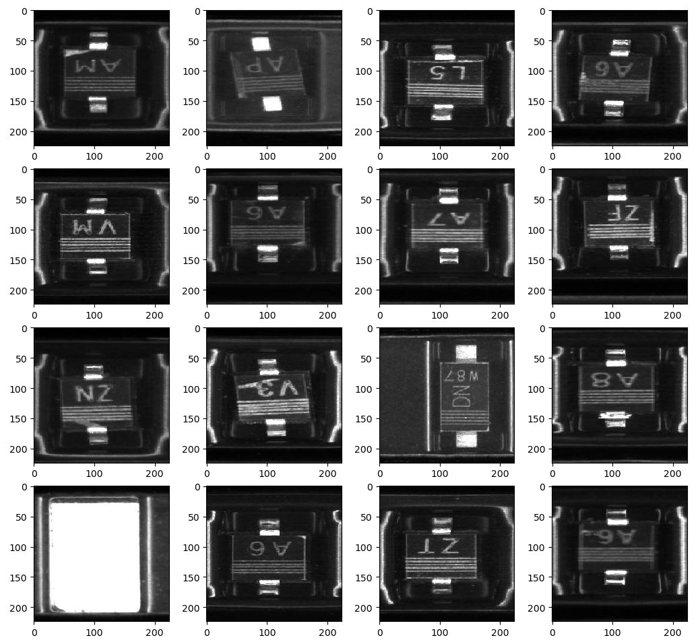
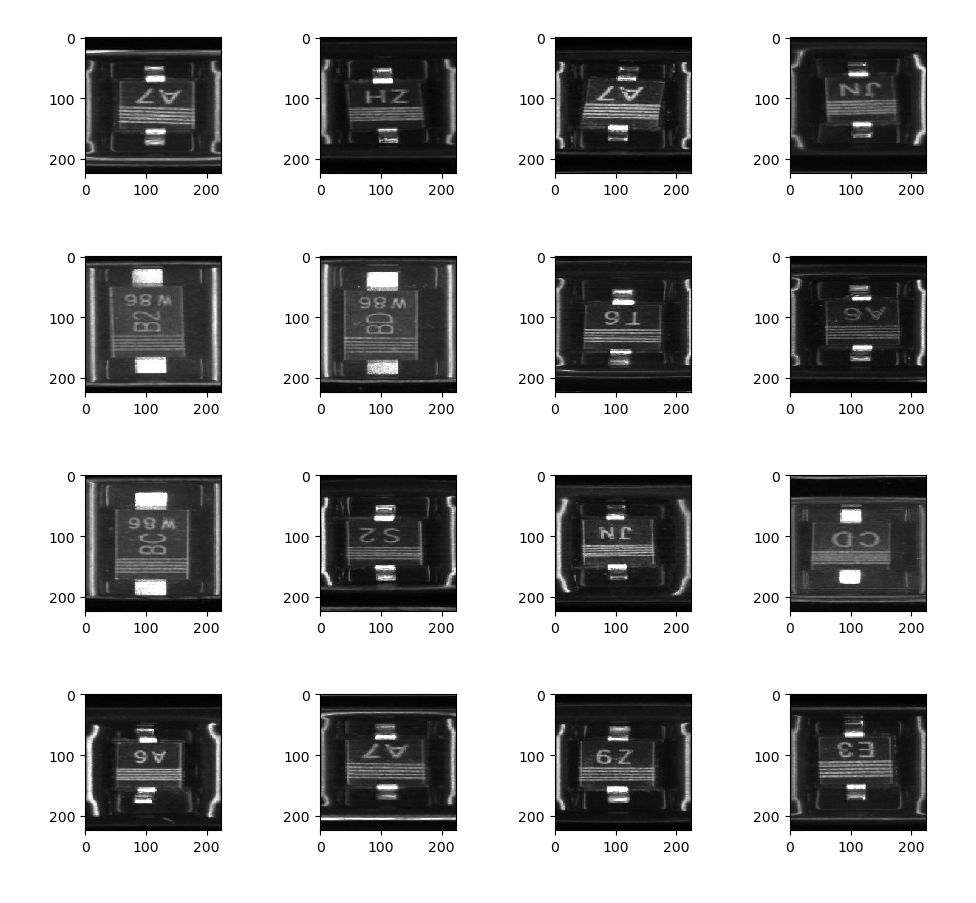

# semi-conductor-image-classification-first

semi-conductor-image-classification-first

The in-class image classification contest, in which you need to build a model and recognise bad chips and good chips.

## Data

Semi-conductor images. Two classes: `{"0": "good_0", "1": "bad_1"}`.

Bad chips for example:

Good chips for example:

## Approches

主要用了简单 CNN，ResNet20v2，和 ResNet56v2。v2 代表使用的是 ResNet version 2，20 和 56 是层数。

## Loss Function

Loss Function 使用 `categorical_crossentropy`, 随后又使用[tensorflow imbalanced_data](https://www.tensorflow.org/tutorials/structured_data/imbalanced_data)中方法进行 class weights 加权。

## Results

Current best score is obtained by ResNet56v2:

| Epoch | AUC        | Public Score | Date     |
| ----- | ---------- | ------------ | -------- |
| 109   | **0.9832** | **0.97156**  | 20200225 |

# License

MIT License
